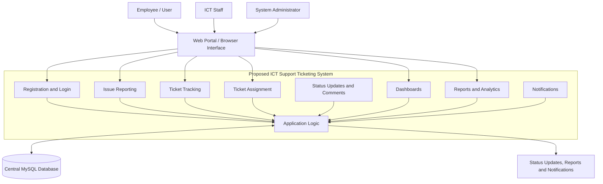
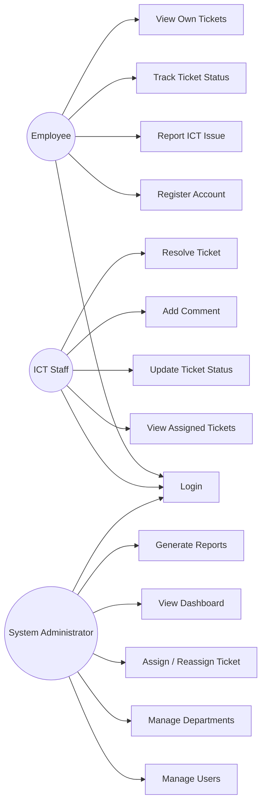
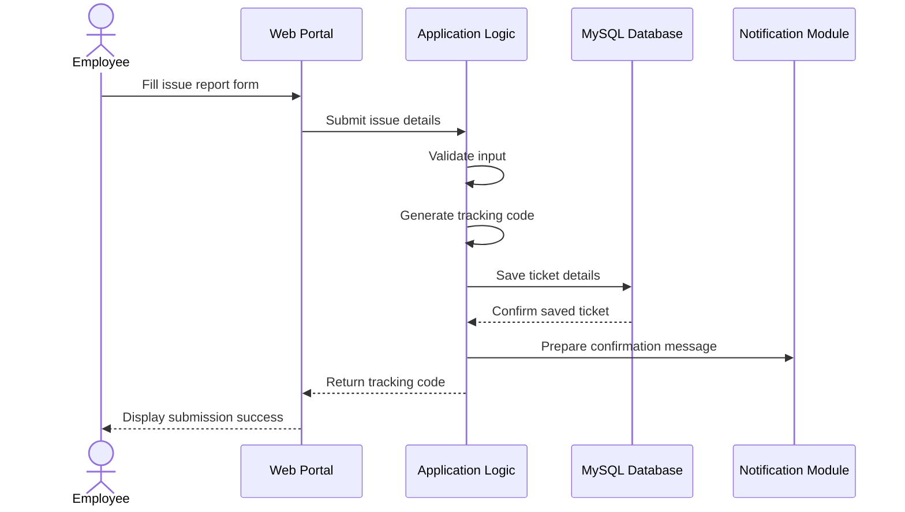
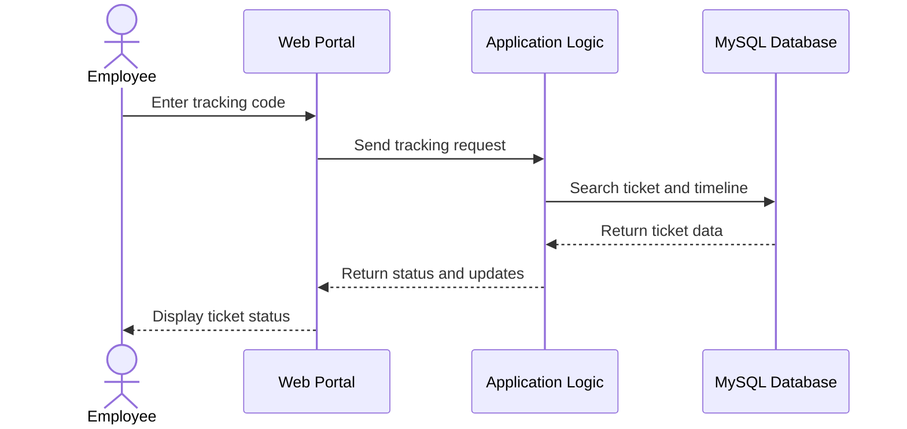
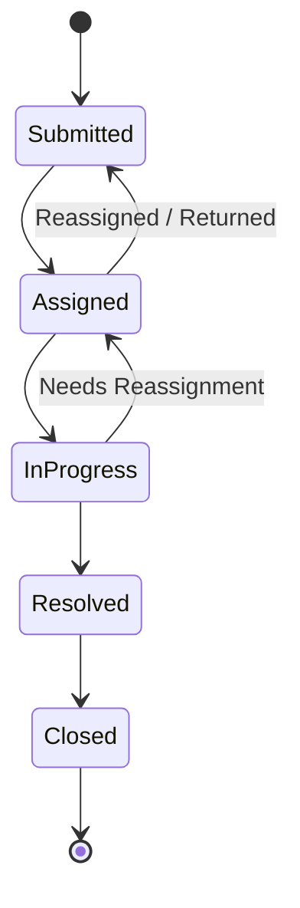
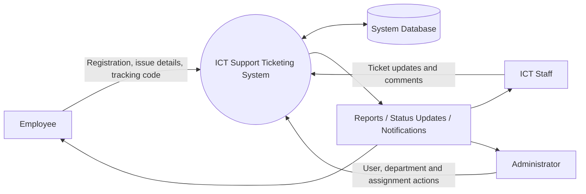
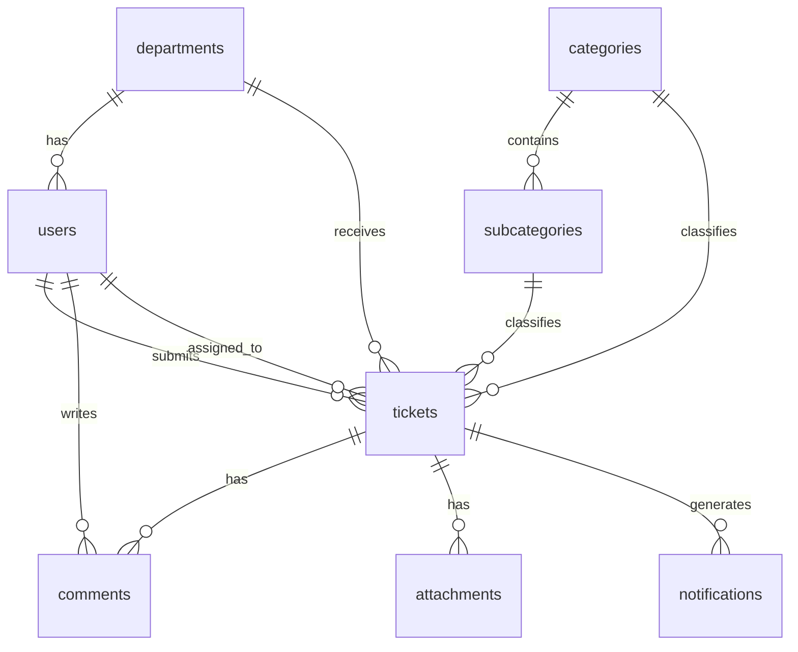

# Proposed ICT Support Ticketing System Design

## 1. Introduction

The proposed ICT Support Ticketing System is a web-based system for reporting, tracking, assigning and resolving ICT issues within an institution. It allows employees to submit problems, ICT staff to manage assigned tickets, and administrators to monitor support performance through dashboards and reports.

## 2. System Objectives

- Provide a centralized platform for reporting ICT issues.
- Generate unique tracking codes for submitted issues.
- Allow employees to track ticket status.
- Support ICT staff in ticket assignment, updates and resolution.
- Help administrators manage users, departments, tickets and reports.
- Improve transparency, accountability and response time in ICT support.

## 3. System Scope

The system covers employee registration, login, issue reporting, ticket tracking, ticket assignment, status updates, comments, dashboards, reports and notifications.

The system does not cover physical repair work itself, external inventory management, payroll integration or full enterprise asset management.

## 4. System Users / Actors

| Actor | Description |
| --- | --- |
| Employee / User | Reports ICT issues and tracks submitted tickets. |
| ICT Staff | Receives assigned tickets, updates status and records resolution notes. |
| System Administrator | Manages users, departments, tickets, reports and system settings. |
| Notification Service | Sends ticket confirmation and update notifications. |

## 5. Functional Requirements

| ID | Requirement |
| --- | --- |
| FR-01 | The system shall allow employees to register using official employee details. |
| FR-02 | The system shall allow users to log in based on their role. |
| FR-03 | The system shall allow employees to report ICT issues. |
| FR-04 | The system shall validate employee details before ticket submission. |
| FR-05 | The system shall generate a unique tracking code for every submitted issue. |
| FR-06 | The system shall allow users to track ticket status using a tracking code. |
| FR-07 | The system shall allow ICT staff to view assigned tickets. |
| FR-08 | The system shall allow ICT staff to update ticket status. |
| FR-09 | The system shall allow ICT staff to add comments and resolution notes. |
| FR-10 | The system shall allow administrators to manage users. |
| FR-11 | The system shall allow administrators to manage departments. |
| FR-12 | The system shall allow administrators to assign or reassign tickets to ICT staff. |
| FR-13 | The system shall provide dashboards showing ticket statistics. |
| FR-14 | The system shall generate reports by status, department, category and staff performance. |
| FR-15 | The system shall store ticket history and comments for auditing. |
| FR-16 | The system shall notify users when tickets are submitted or updated. |

## 6. Non-Functional Requirements

| ID | Requirement |
| --- | --- |
| NFR-01 | The system shall be accessible through a web browser. |
| NFR-02 | The system shall use role-based access control. |
| NFR-03 | The system shall protect passwords using secure hashing. |
| NFR-04 | The system shall validate user input to reduce invalid data and security risks. |
| NFR-05 | The system shall use prepared database queries to prevent SQL injection. |
| NFR-06 | The system shall provide a responsive interface for desktop and mobile devices. |
| NFR-07 | The system shall respond to common user actions within an acceptable time. |
| NFR-08 | The system shall maintain ticket records reliably in a central database. |
| NFR-09 | The system shall be maintainable using clear PHP, CSS, JavaScript and database structure. |
| NFR-10 | The system shall support backup and recovery of system data. |
| NFR-11 | The system shall provide understandable error messages to users. |
| NFR-12 | The system shall keep system modules separated for easier maintenance. |

## 7. Proposed System Block Diagram

## 8. Use Case Diagram

## 9. Use Case Descriptions

### UC-01: Register Account

| Item | Description |
| --- | --- |
| Actor | Employee |
| Goal | Create an employee account. |
| Preconditions | Employee has valid institutional details. |
| Main Flow | Employee opens registration page, enters details, system validates data, system creates account. |
| Postcondition | Employee account is stored in the database. |

### UC-02: Report ICT Issue

| Item | Description |
| --- | --- |
| Actor | Employee |
| Goal | Submit an ICT issue for support. |
| Preconditions | Employee is registered or verified. |
| Main Flow | Employee enters issue details, selects department/category, attaches evidence if available, submits the form, system creates ticket and tracking code. |
| Postcondition | Ticket is saved and available for ICT staff/admin action. |

### UC-03: Track Ticket Status

| Item | Description |
| --- | --- |
| Actor | Employee |
| Goal | View progress of a submitted issue. |
| Preconditions | Employee has a valid tracking code. |
| Main Flow | Employee enters tracking code, system searches ticket, system displays status and timeline. |
| Postcondition | Employee sees the latest ticket status. |

### UC-04: Update Ticket Status

| Item | Description |
| --- | --- |
| Actor | ICT Staff |
| Goal | Record progress on assigned ticket. |
| Preconditions | ICT staff is logged in and ticket is assigned. |
| Main Flow | ICT staff opens ticket, changes status, adds comment or resolution note, system saves update. |
| Postcondition | Ticket timeline and status are updated. |

### UC-05: Assign Ticket

| Item | Description |
| --- | --- |
| Actor | System Administrator |
| Goal | Allocate a ticket to ICT staff. |
| Preconditions | Admin is logged in and ticket exists. |
| Main Flow | Admin views tickets, selects ICT staff, assigns/reassigns ticket, system stores assignment. |
| Postcondition | Ticket appears in ICT staff workload. |

### UC-06: Generate Reports

| Item | Description |
| --- | --- |
| Actor | System Administrator |
| Goal | Monitor ICT support performance. |
| Preconditions | Ticket data exists. |
| Main Flow | Admin opens reports page, selects report/filter, system aggregates data and displays report. |
| Postcondition | Admin views ticket statistics and performance data. |

## 10. Ticket Submission Sequence Diagram

## 11. Ticket Tracking Sequence Diagram

## 12. Ticket Resolution Workflow

## 13. Data Flow Diagram Level 0

## 14. Main Modules

| Module | Purpose |
| --- | --- |
| Authentication Module | Handles login, logout, registration and role checking. |
| Employee Module | Allows employees to report issues and view their tickets. |
| Ticket Module | Handles ticket creation, status changes, comments and tracking codes. |
| ICT Staff Module | Allows staff to manage assigned tickets and resolution updates. |
| Admin Module | Manages departments, users, ticket assignment and system oversight. |
| Reporting Module | Generates dashboard statistics and analytical reports. |
| Notification Module | Sends or prepares status notifications. |
| Database Module | Stores and retrieves system records. |

## 15. Proposed Database Design

| Table | Purpose |
| --- | --- |
| users | Stores employee, ICT staff and admin accounts. |
| departments | Stores institutional departments. |
| categories | Stores main ICT issue categories. |
| subcategories | Stores detailed issue categories. |
| tickets | Stores submitted ICT issues and status. |
| comments | Stores ticket comments and timeline updates. |
| attachments | Stores evidence file details. |
| notifications | Stores notification messages and delivery status. |

## 16. Entity Relationship Overview

## 17. Security Design

- Users access features according to role: employee, ICT staff or administrator.
- Passwords should be stored using secure hashing.
- Database queries should use prepared statements.
- User input should be validated before processing.
- Output should be escaped to prevent cross-site scripting.
- Sessions should be protected using secure cookie settings.
- Admin and ICT functions should require login.

## 18. User Interface Design

The system interface should include:

- Public navigation for reporting issues, checking status and logging in.
- Employee dashboard for personal tickets and new reports.
- ICT staff dashboard for workload and assigned tickets.
- Admin dashboard for users, departments, tickets and reports.
- Responsive layout for mobile and desktop devices.

## 19. Assumptions

- The institution has a list of valid employees.
- Users have access to a web browser.
- Administrators will create or manage ICT staff accounts.
- The database server is available during system operation.
- Email or notification delivery depends on server configuration.

## 20. Constraints

- The system depends on PHP and MySQL/MariaDB.
- Notification delivery may require SMTP configuration.
- File uploads depend on server storage and permissions.
- System performance depends on server resources and database indexing.

## 21. Conclusion

The proposed ICT Support Ticketing System provides a structured way to report, track and resolve ICT issues. Its design supports transparency for employees, workload management for ICT staff and monitoring tools for administrators.
