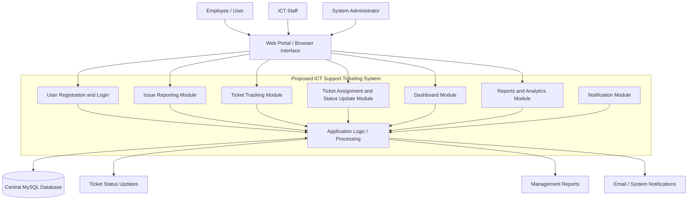

# System Structure & Implementation Guide

## Overview

This document describes a full, practical structure for the ICT Support Ticketing System: architecture, folder layout, database schema, API endpoints, UI flows, security practices, testing, deployment and an implementation roadmap.

Goals:
- Secure user registration and authentication with role-based access.
- Web ticket submission for employees with attachments and tracking codes.
- Ticket tracking and timeline visibility for users and staff.
- Assignment, triage and resolution workflow for ICT staff.
- Reporting and analytics for monitoring performance and trends.

---

## High-Level Architecture

- Client (browser): HTML/CSS/vanilla JS progressive enhancement.
- Server: PHP app (existing codebase), using `mysqli`/PDO with prepared statements.
- Database: MySQL/MariaDB.
- File storage: local protected uploads or object storage (S3) for scale.
- Email: SMTP or transactional provider for notifications.

Design principles:
- Keep server-side validation authoritative.
- Use RBAC (roles: `employee`, `ict`, `admin`).
- Maintain an audit trail of all ticket events.

### Proposed System Block Diagram

The proposed ICT Support Ticketing System is a web-based system where employees report ICT problems, ICT staff handle assigned tickets, and administrators manage users, departments, tickets and reports. The system stores all data in a central database and produces status updates, dashboards and reports.



### Block Description

- **Employee / User:** reports ICT issues and tracks progress using a tracking code.
- **ICT Staff:** views assigned tickets, updates ticket status and adds resolution comments.
- **System Administrator:** manages users, departments, tickets and reports.
- **Web Portal / Browser Interface:** the front-facing interface used to access the system.
- **Application Logic / Processing:** validates requests, creates tickets, assigns tickets, updates statuses and prepares reports.
- **Central MySQL Database:** stores users, departments, tickets, comments, attachments, notifications and report data.
- **Outputs:** ticket status updates, management reports and system/email notifications.

---

## Recommended Folder Structure

Follow the existing project layout; suggested logical mapping and additions:

- `index.php` — public landing page
- `login.php`, `register.php`, `logout.php` — auth flows
- `report.php`, `track.php` — public reporting & tracking
- `includes/` — shared helpers, auth functions, header/footer, helpers.php
- `admin/` — admin UI and management pages
- `staff/` — ICT staff UI
- `api/` — ajax endpoints (submit_ticket.php, track_ticket.php, verify_employee.php)
- `assets/` — CSS/JS/images
- `uploads/` — protected user attachments (store outside webroot if possible)
- `config/` — config/app.php, config/db.php
- `database/` — schema, migration scripts
- `tests/` (recommended) — integration and unit tests
- `docs/` (recommended) — design docs, runbooks

---

## Database Schema (core tables)

Below are the core tables and essential fields. Add indexes on `created_at`, `status`, and foreign keys.

1) `users`

 - `id` INT PK
 - `full_name` VARCHAR
 - `employee_number` VARCHAR UNIQUE
 - `email` VARCHAR UNIQUE
 - `phone` VARCHAR
 - `department_id` INT FK
 - `role` ENUM('employee','ict','admin')
 - `password_hash` VARCHAR
 - `active` TINYINT
 - `created_at`, `updated_at`

2) `departments`

 - `id`, `name`

3) `categories` / `subcategories`

 - classification tables: `id`, `name`, `parent_id` (optional)

4) `tickets`

 - `id` PK
 - `tracking_code` VARCHAR UNIQUE
 - `user_id` FK (nullable for public submissions)
 - `department_id` FK
 - `category_id`, `subcategory_id`
 - `title`, `description`
 - `status` ENUM('new','triaged','assigned','in_progress','resolved','closed')
 - `priority` ENUM or INT
 - `created_at`, `updated_at`

5) `ticket_events` (audit trail)

 - `id`, `ticket_id`, `type` (comment, status_change, assignment), `actor_id`, `data` (JSON), `created_at`

6) `assignments`

 - `id`, `ticket_id`, `assignee_id`, `assigned_by`, `assigned_at`, `active`

7) `attachments`

 - `id`, `ticket_id`, `filename`, `path`, `uploaded_by`, `created_at`

Notes:
- Use `ticket_events` to recreate timelines and power reports.
- Keep user-identifying data normalized to `users` with FK constraints.

Example tracking code: `ICT-AB12CD34-YYMMDD` (prefix + short random + date)

---

## API / Server Endpoints

Design a small set of endpoints for AJAX and integrations. Protect endpoints with session/auth tokens and CSRF tokens for forms.

- `POST /api/submit_ticket.php` — submit ticket data + multipart file uploads; returns tracking code.
- `POST /api/verify_employee.php` — verify badge/employee existence
- `GET /api/track_ticket.php?code=...` — public ticket status by tracking code
- `POST /api/assign_ticket.php` — assign ticket to staff (admin/ict only)
- `POST /api/update_status.php` — change status, add event
- `GET /api/tickets?filter=...` — staff/admin list with pagination and search

Authentication for API calls:
- Use server-side sessions (cookie) for browser flows.
- For external systems, use API tokens with limited scope.

---

## UI Flows (user journeys)

1) Registration

- Employee fills `register.php` (badge, name, email, password).
- Server validates uniqueness of `employee_number` and `email`.
- Password hashed; user created with role `employee` and `active=1` (or require admin activation).
- Optional email confirmation. Redirect to `login.php?registered=1`.

2) Login

- `login.php` accepts email/password; on success regenerate session id and set secure cookie.
- Support `next` redirect parameter for returning to `report.php` after auth.

3) Ticket Submission

- Multi-step wizard: verify employee (step 1) → classify issue (step 2) → attachments (step 3) → review & submit (step 4).
- On submit: create `tickets` row, `attachments` entries, and create initial `ticket_events` entry. Email confirmation with tracking code.

4) Tracking

- Public `track.php` allows entering a tracking code and viewing timeline (ticket_events) and public comments.
- Authenticated users see a dashboard with their tickets and internal events.

5) Assignment & Resolution

- Staff/admin view queue; can triage, assign, comment, and mark resolved.
- Each action creates `ticket_events` with actor and timestamp.

---

## Reporting & Analytics

Key reports:

- Ticket volume (per day/week/month)
- Average time to triage, first-response, and resolution
- Tickets by department/category
- Open tickets by staff (workload)
- SLA breaches and trending categories

Implementation notes:
- Use aggregated queries, GROUP BY and indexed `created_at` to compute metrics.
- For heavy loads, add materialized views or nightly aggregation tables.
- Visualize with Chart.js or similar in `admin/reports.php`.

---

## Security Best Practices

- Passwords: use `password_hash()` (bcrypt/Argon2) and `password_verify()`.
- SQL: use prepared statements everywhere (no string interpolation).
- Sessions: `session.cookie_secure`, `HttpOnly`, `SameSite=Lax`, regenerate session id on login.
- CSRF: token per form, validated on POST.
- XSS: escape output with helper `e()` in templates.
- Uploads: limit types/sizes, store outside webroot, sanitize filenames, virus-scan if possible.
- Rate-limiting: throttle login attempts and ticket submission frequency.
- HTTPS: enforce TLS, HSTS, secure headers (CSP, X-Frame-Options, X-Content-Type-Options).

---

## Notifications

- Send confirmation email on ticket creation with tracking code.
- Notify assignee(s) on assignment and status change.
- Optionally provide SMS/Slack integration for critical alerts.

---

## Testing & QA

- Unit tests for helpers and auth logic.
- Integration tests for registration, login, and ticket submission flows.
- End-to-end tests (Cypress / Playwright) for core journeys.
- Load test the reporting endpoints and ticket listing.

---

## Deployment & Maintenance

- Environment variables for DB, SMTP, storage credentials stored outside repo.
- Backups: daily DB dumps, periodic attachment backups.
- Rolling deploy steps: take maintenance page, apply DB migrations, run migrations, warm caches, resume traffic.
- Logs & monitoring: centralize logs, integrate Sentry or similar, set up uptime checks.

---

## Implementation Roadmap (milestones)

1. Core auth: `users` table, `register.php`, `login.php`, secure sessions.
2. Ticket creation: `tickets`, attachments, `ticket_events`, public tracking.
3. Staff workflows: assignment UI, staff dashboard, internal comments.
4. Notifications and email templates.
5. Reports & analytics, exports, scheduled reports.
6. Hardening: rate-limiting, tests, backups, monitoring.

---

## Appendix: Example SQL (minimal)

```sql
CREATE TABLE users (
  id INT AUTO_INCREMENT PRIMARY KEY,
  full_name VARCHAR(255) NOT NULL,
  employee_number VARCHAR(100) UNIQUE,
  email VARCHAR(255) UNIQUE NOT NULL,
  phone VARCHAR(50),
  department_id INT,
  role ENUM('employee','ict','admin') NOT NULL DEFAULT 'employee',
  password_hash VARCHAR(255) NOT NULL,
  active TINYINT DEFAULT 1,
  created_at TIMESTAMP DEFAULT CURRENT_TIMESTAMP,
  updated_at TIMESTAMP DEFAULT CURRENT_TIMESTAMP ON UPDATE CURRENT_TIMESTAMP
);

CREATE TABLE tickets (
  id INT AUTO_INCREMENT PRIMARY KEY,
  tracking_code VARCHAR(64) UNIQUE NOT NULL,
  user_id INT,
  department_id INT,
  category_id INT,
  subcategory_id INT,
  title VARCHAR(255),
  description TEXT,
  status VARCHAR(32) DEFAULT 'new',
  priority INT DEFAULT 3,
  created_at TIMESTAMP DEFAULT CURRENT_TIMESTAMP,
  updated_at TIMESTAMP DEFAULT CURRENT_TIMESTAMP ON UPDATE CURRENT_TIMESTAMP
);
```

---

If you want this document placed in a different path or expanded into separate files (DB schema SQL, API reference, sequence diagrams), tell me which pieces to expand and I'll generate them next.
